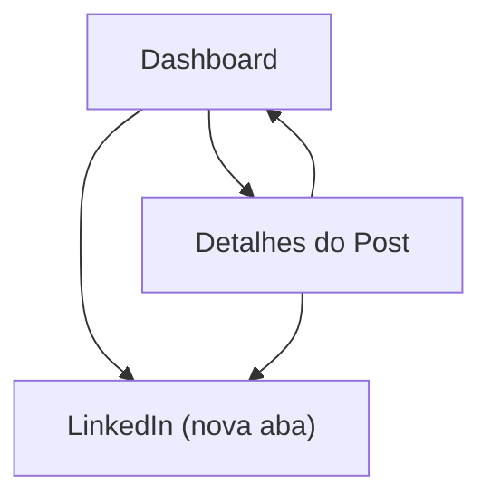

## 1. Product Overview
Melhorar a UI do dashboard para exibir a lista de posts em formato de cards.
O objetivo é facilitar leitura rápida do conteúdo, identificação de status e acesso às ações (detalhes e link do LinkedIn).

## 2. Core Features

### 2.1 Feature Module
Os requisitos consistem das seguintes páginas principais:
1. **Dashboard**: grade de cards de posts com imagem, prévia de texto, badge de status, data e ações.
2. **Detalhes do Post**: visualização detalhada ao clicar no botão de detalhes (página ou modal).

### 2.2 Page Details
| Page Name | Module Name | Feature description |
|-----------|-------------|---------------------|
| Dashboard | Lista de posts (cards) | Exibir posts em cards com layout consistente e navegável. |
| Dashboard | Mídia do post | Mostrar imagem de capa/preview no card; usar fallback quando não houver imagem. |
| Dashboard | Prévia de conteúdo | Renderizar apenas as **3 primeiras linhas** do texto do post (com truncamento/ellipsis). |
| Dashboard | Status | Exibir **badge de status** no card (texto curto e cor de destaque). |
| Dashboard | Rodapé do card | Mostrar **data** do post no rodapé (formato consistente). |
| Dashboard | Ações do card | Disponibilizar **botão “Detalhes”** e **link do LinkedIn** (abrir em nova aba). |
| Detalhes do Post | Conteúdo completo | Exibir conteúdo completo do post selecionado. |
| Detalhes do Post | Acesso ao LinkedIn | Exibir link do LinkedIn do post e permitir abrir em nova aba. |
| Detalhes do Post | Voltar/Fechar | Permitir retornar ao dashboard (fechar modal ou navegar de volta). |

## 3. Core Process
**Fluxo principal (usuário):**
1. Você abre o Dashboard e vê a lista de posts em cards.
2. Você identifica rapidamente o status pelo badge e lê a prévia (3 linhas).
3. Você pode:
   - Clicar em **Detalhes** para ver o conteúdo completo.
   - Clicar no **link do LinkedIn** para abrir a publicação no LinkedIn em nova aba.
4. Você fecha/volta de Detalhes e continua navegando pelos cards.

