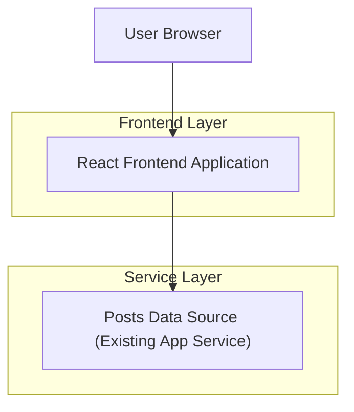

## 1.Architecture design

## 2.Technology Description
- Frontend: React@18 + TypeScript + (CSS/Tailwind ou CSS Modules)
- Backend: Existente (fora do escopo desta melhoria de UI)

## 3.Route definitions
| Route | Purpose |
|-------|---------|
| /dashboard | Dashboard com lista de posts em cards (imagem, prévia 3 linhas, badge de status, data, ações) |
| /posts/:id (opcional) | Tela de detalhes do post (caso não seja modal) |